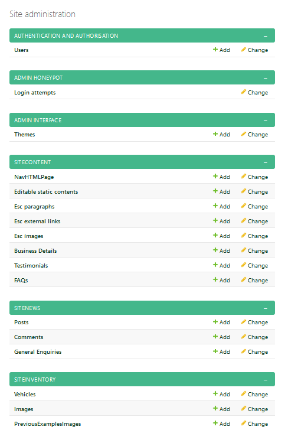

# UsaVehicleImports-Django

## DESCRIPTION

Django redesign of a real wordpress website using static content and images taken from the active site and their social media accounts. Built with bootstrap5 and custom css, uses built-in sqlite and developed a client admin access. Styling based on an original design template previously created with node/express.
  
Provide the client with an admin page to add/edit site content, vehicle inventory, upload images and videos. View general enquiries generated by users and saved to db, add/edit news posts with images and videos.

Site to provide user interaction with local default email access, contact us form, dynamically generated stock viewing including enquiry form. A news post including capabilities to like, comment, share on social media, and play a video. Redirection to business social media accounts via navbar, and business address with open google map view/redirection in news page and footer. Services content can also include a useful resource external link. No business requirement or benefit to create users so all visitors are anonymous.

Site is two tier model with no requirement to purchase stock as enquiries are preferred to be redirected to the business owner/team. Services that are provided are dependent on clients requirements and has no fixed priced service to advertise. Limited holding stock dependant on client to update.
This can be off putting to new enquires as other competitors do advertise some costs. This also misses the chance of further SEO optimisation where they can provide a price comparison table if the data is in their favour. However, it does reduce the burden on site administration.  

## SECTION TITLES WITH EDITABLE CONTENT TYPES AVAILABLE ON EACH PAGE

The point is to provide a business admin advocate the ability to make changes rather than relying on the website creator thus reducing hard coded data to its bare minimum. The main drawback to this is that it could increase the chance of mistakes and sub par content but could reduce the cost of maintenance from the website creator.
Each page has designated named areas with specific content types, shown below, so it is easier to identify the placeholders in the html code and what can be changed. They are available as dropdown options on creation.

Home page -
    'HomeHero' = header and paragraph
    'Home' = header, paragraph, image and (i) image description
Services page -
    'Importing' = content badge, header, subheader, paragraphs, external links, image and (i) image description
    'Sourcing' = content badge, header, subheader, paragraphs, external links, image and (i) image description
    'Transportation' = content badge, header, subheader, paragraphs, external links, max of 5x images
Gallery page -
    'GalleryHero' = header, paragraph
    'GalleryBreaker' = header, paragraph
    'GalleryExamplePics' = header, paragraph
News page -
    'NewsHero' = header, paragraph
Nav links -
    Can change name of page links and include a description which is used on the home page. Fixed field names Home, Services, Gallery, and News are used for navigation with title added to change what is displayed.

Additional database tasks required to setup prior to release and ongoing light self maintenance by adding images to PreviousExamplesImages (carousel), include Faqs for user reassurance, adding Testimonials if available, and update BusinessDetails if needed.

## NOTE

Business details will require site administrator to get the google map link for a postcode change and overwrite existing link in the news.html, iframe, line 61. Currently no api linked to database to automatically change.

## ONGOING SITE ADMINISTRATION TASKS BY BUSINESS ADVOCATE

The business can add posts consisting of text, an image, and a video. These posts include the options for the user to like, comment, and share on social media. The like takes session data so the post is not liked multiple times by the same user during the session. This is not foolproof against manipulation but may be enough for the expected audience without having to go down the route of recording ip addresses. Dislikes are not included.

User comments are not automatically shown within the post it relates to. Each one requires moderation to check its suitability and will be shown if the active field is clicked in the admin page. The business can make a reply to a comment. The comment number shown on the site only counts moderated comments. A message is displayed to the user on submission and includes an explanation on the form that it will be sent for moderation first.

A generalEnquiry submitted by a user can be either through the contact us form or inventory enquiry form. Both are saved to the database and both are emailed to a free third party service Formspree where it is also stored and a confirmation email sent to a designated business address. The admin page includes fields for the advocate to record when the enquiry has been responded to by the business admin team but no further details as their own systems should be used without any double entry. It keeps the responsibilities of the website and business admin system separate.

Vehicle inventory to add/delete/edit cars for sale or sold. As the site does not cater for direct sales an enquiry form button is added. Each vehicle is displayed in a card with a carousel for images, description, availability, price, type (dropdown choices), and video fields.

## NOTE

- Holding stock advertised with price but unclear where to visit and view so may require confirmation on website or redirection to enquiries.
- Not clear of process to import may need further explanation on separate page, within the services page, or part of Faqs section. Competitors go into some detail with licenses, fees, tax etc.
