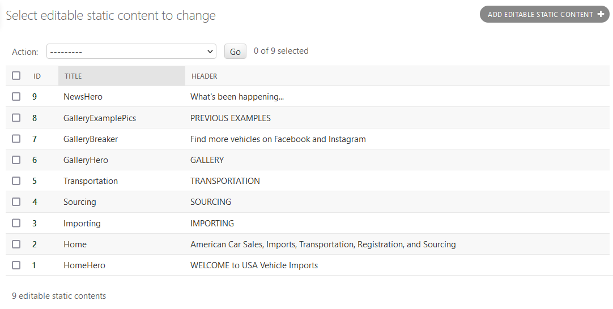
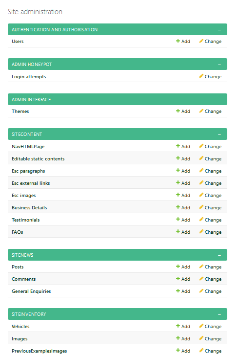
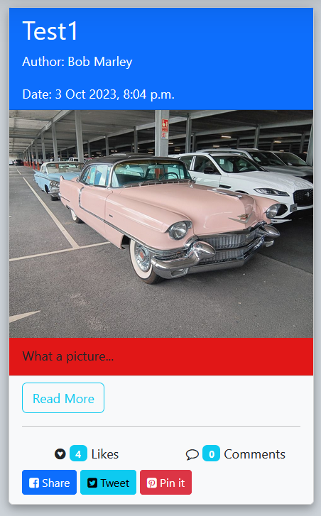
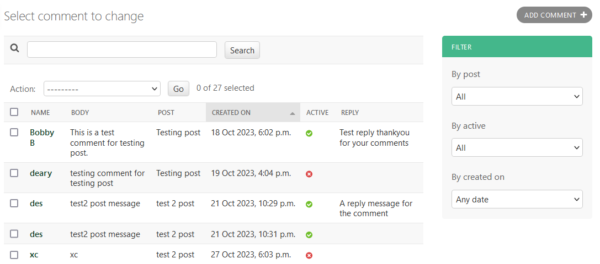
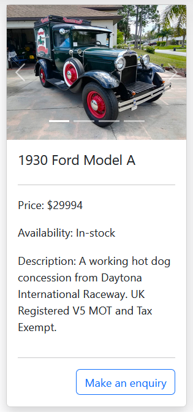

# UsaVehicleImports-Django

## Learning Django

This is a simple project undertaken to further learn Django, currently un-hosted. It is version 3.1 of a progressive process starting with v1 created in html/css/javascript/json only, and v2 created with node/express but incomplete, and 3.0 in django with the content hard coded in.

## DESCRIPTION

Re-design of a real wordpress american vehicle importer website using content and images taken from the active site and their social media accounts. Built with bootstrap5 and custom css/javascript, uses built-in sqlite3 and a customised client admin page. Includes honeypot package for admin login and a honeypot method for enquiry forms.
  
It provides the client with an admin page to add/edit site content, vehicle inventory, upload images and videos. View general enquiries generated by users and saved to db, add/edit news posts with images and videos.

The site provides user interaction with local default email access, contact us form, dynamically generated stock viewing including enquiry form. A news post including capabilities to like, comment, share on social media, and play a video. Redirection to business social media accounts via navbar, and business address with open google map view/redirection in news page and footer. Services content can also include a useful resource external link. No business requirement or benefit to create users so all visitors are anonymous.

The site is a two tier model with no requirement to purchase stock as enquiries are preferred to be redirected to the business owner/team. Services that are provided are dependent on clients requirements and has no fixed priced service to advertise. Limited holding stock dependant on client to update.
This can be off putting to new enquires as other competitors do advertise some costs. This also misses the chance of further SEO optimisation where they can provide a price comparison table if the data is in their favour. However, it does reduce the burden on site administration support.  

## SECTION TITLES WITH EDITABLE CONTENT TYPES AVAILABLE ON EACH PAGE

The point is to provide a business admin advocate the ability to make content changes rather than relying on the website creator by reducing hard coded data to its absolute bare minimum. The main drawback to this is that it could increase the chance of mistakes and sub-par content but could reduce the cost of maintenance provided by the website creator.
Each page has designated named areas with specific content types, shown below, so it is easier to identify the placeholders in the html code and indicate to the advocate what can be changed. They are available as dropdown options on creation in admin page to limit confusion.

| Page | Title | Content types |
|------|-------|---------------|
| Home page |'HomeHero' | header and paragraph |
| | 'Home' | header, paragraph, image and (i) image description |
| Services page | 'Importing' | content badge, header, subheader, paragraphs, external links, image and (i) image description |
| | 'Sourcing' | content badge, header, subheader, paragraphs, external links, image and (i) image description |
| | 'Transportation' | content badge, header, subheader, paragraphs, external links, max of 5x images |
| Gallery page | 'GalleryHero' | header, paragraph |
| | 'GalleryBreaker' | header, paragraph |
| | 'GalleryExamplePics' | header, paragraph |
| News page |'NewsHero' | header, paragraph |
 
| Nav links | |Can change name of page links and include a description which is used on the home page. Fixed field names Home, Services, Gallery, and News are used for navigation with title added to change what is displayed. |
||||

<figure>
    
    <figcaption><em>Admin view with titles selected from dropdown menu on creation.</em></figcaption>
</figure>

Additional database tasks required to setup prior to release and ongoing light self maintenance by adding images to PreviousExamplesImages (carousel), include Faqs for user reassurance, adding Testimonials if available, and update BusinessDetails if needed.

## 

> **NOTE:** If the business postcode needs changing it will require the website creator to get the google map link and overwrite the existing link in the news.html, iframe, line 61 and footer. Currently no api linked to database to automatically change. Gallery background images are set in css so this would also need the website creator to change if required after production.

## 

## ONGOING SITE ADMINISTRATION TASKS BY BUSINESS ADVOCATE

<figure>
    
    <figcaption><em>In sitecontent the Editable content includes in-line tables esc paragraphs, esc images, esc external links. In site inventory the vehicle includes in-line table images</em></figcaption>
</figure>

The business can add posts consisting of text, an image, and a video. These posts include the options for the user to like, comment, and share on social media. The like takes session data so the post is not liked multiple times by the same user during the session. This is not foolproof against manipulation but may be enough for the expected audience without having to go down the route of recording ip addresses. Dislikes are not included. Each post is constructed from different content types and only take up space if they exist.

<figure>
    
    
    <figcaption><em>Gibberish post. Read more drops down to show post text content, video, external linked image, comments and replys. </em></figcaption>
</figure>

User comments are not automatically shown within the post it relates to. Each one requires moderation to check its suitability and will be shown if the active field is clicked in the admin page. The business can make a reply to a comment. The comment number shown on the site only counts moderated comments. A message is displayed to the user on submission and includes an explanation on the form that it will be sent for moderation first.

<figure>
    
    <figcaption><em>All data shown is gibberish and for example view only.</em></figcaption>
</figure>

A generalEnquiry submitted by a user can be either through the contact us form or inventory enquiry form. Both are saved to the database and both are emailed to a free third party service Formspree where it is also stored and a confirmation email sent to a designated business address. The admin page includes fields for the advocate to record when the enquiry has been responded to by the business admin team but no further details as their own systems should be used without any double entry. It keeps the responsibilities of the website and business admin system separate.

Vehicle inventory to add/delete/edit cars for sale or sold. As the site does not cater for direct sales an enquiry form button is added. Each vehicle is displayed in a card with a carousel for images, description, availability, price, type (dropdown choices), and video fields.

<figure>
    
    <figcaption><em>Data shown is directly taken from active site.</em></figcaption>
</figure>

Testimonials and faqs are only shown and take up space if they exist. Navbar links can be either text or a fontawesome icon. When creating an fa icon the full path such as fa fa-home is entered in db and only fa types not the newer fas, fab etc.

## NOTES

- Holding stock advertised with price but unclear where to visit and view in person without requesting via form. May require confirmation on website or redirection to enquiries.
- Not clear of the process to import. May need further explanation on separate page, within the services page, or part of Faqs section. Competitors go into some detail with licenses, fees, tax etc.

## EXAMPLE FAQs

- Is there a catalogue of american vehicles that can be viewed on the website?

Yes, there is a catalogue of American vehicles available on the website. On the gallery page you can browse an inventory section and view details of each vehicle including images, description, availability, price, type, and even watch videos. If you are interested in a particular vehicle, you can use the enquiry form to request more information. A carousel of vehicles we have previously sourced for customers are also included to view.

 **Q: What is the process of importing a car myself from the United States to the United Kingdom?**

A: The process of importing a car from the United States to the United Kingdom can be complex and time-consuming. However, it is possible to do it yourself if you are willing to put in the effort. The following steps will help as a guide:

1. **Find a car that you want to import.** You can do this by searching online or through a car dealer. Once you have found a car, you will need to get a quote from a shipping company.
2. **Get the car inspected.** Before you can import a car to the United Kingdom, it must be inspected by a government-approved inspector. The inspector will check the car for any defects and make sure that it meets all of the safety requirements.
3. **Get the car titled and registered.** Once the car has been inspected, you will need to get it titled and registered in the United Kingdom. This process can take several weeks, so it is important to start it early.
4. **Pay the import duties and taxes.** When you import a car to the United Kingdom, you will have to pay import duties and taxes. The amount of duty and tax you will have to pay depends on the value of the car.
5. **Get the car shipped.** Once you have paid the import duties and taxes, you can arrange to have the car shipped to the United Kingdom. The shipping time will vary depending on the shipping company you use.

**Q: What are the costs involved in importing a car from the United States to the United Kingdom?**

The costs involved in importing a car from the United States to the United Kingdom can vary depending on the make, model, and year of the car. However, you can expect to pay the following costs:

* Shipping costs: The shipping costs will vary depending on the size of the car and the shipping company you use. You can expect to pay anywhere from £1,000 to £3,000 for shipping.
* Import duties and taxes: The import duties and taxes will vary depending on the value of the car. You can expect to pay anywhere from 10% to 20% of the value of the car in import duties and taxes.
* Inspection fees: You will need to pay an inspection fee to have the car inspected by a government-approved inspector. The inspection fee will typically cost around £100.
* Title and registration fees: You will need to pay a title and registration fee to have the car titled and registered in the United Kingdom. The title and registration fees will typically cost around £200.

**Q: What are the benefits of importing a car from the United States to the United Kingdom?**

There are a few benefits to importing a car from the United States to the United Kingdom. These benefits include:

* You can get a car that is not available in the United Kingdom.
* You can get a car that is more affordable than a similar car in the United Kingdom.
* You can get a car that has more features than a similar car in the United Kingdom.

**Q: What are the risks of importing a car from the United States to the United Kingdom?**

There are a few risks associated with importing a car from the United States to the United Kingdom. These risks include:

* The car may not meet the safety requirements of the United Kingdom.
* The car may not be compatible with the electrical system of the United Kingdom.
* The car may not be covered by a warranty in the United Kingdom.

**Q: Is it worth it to import a car from the United States to the United Kingdom?**

Whether or not it is worth it to import a car from the United States to the United Kingdom depends on your individual circumstances. If you are looking for a car that is not available in the United Kingdom, or if you are looking for a car that is more affordable than a similar car in the United Kingdom, then it may be worth it to import a car from the United States. However, if you are concerned about the safety of the car, or if you are concerned about the car being compatible with the electrical system of the United Kingdom, then it may not be worth it to import a car from the United States.

**Q: What are the different types of cars that can be imported from the United States to the United Kingdom?**

A: There are a variety of different types of cars that can be imported from the United States to the United Kingdom. Some of the most popular types of cars include:

* Sedans
* Coupes
* SUVs
* Trucks
* Vans
* Sports cars
* Luxury cars
* Electric cars

**Q: What are the different shipping methods that can be used to import a car from the United States to the United Kingdom?**

A: There are a few different shipping methods that can be used to import a car from the United States to the United Kingdom. The most common shipping methods include:

* Ro-Ro shipping: Ro-Ro shipping is a type of shipping in which the car is loaded onto a ship and driven off the ship at its destination.
* Container shipping: Container shipping is a type of shipping in which the car is loaded into a container and shipped in a container ship.
* Air freight: Air freight is a type of shipping in which the car is flown to its destination.

**Q: How long does it take to import a car from the United States to the United Kingdom?**

The length of time it takes to import a car from the United States to the United Kingdom depends on the shipping method that is used. Ro-Ro shipping typically takes around 2-3 weeks, while container shipping typically takes around 4-6 weeks. Air freight typically takes around 1-2 weeks.

**Q: What are the different documents that are required to import a car from the United States to the United Kingdom?**

The documents that are required to import a car from the United States to the United Kingdom include:

* A bill of sale
* A title
* A registration certificate
* A customs declaration
* A carnet de passage
* A vehicle inspection report
* A vehicle safety certificate
* A vehicle emissions certificate

**Q: What are the different government agencies that are involved in the import of cars from the United States to the United Kingdom?**

The different government agencies that are involved in the import of cars from the United States to the United Kingdom include:

* The Department of Transportation
* The Environmental Protection Agency
* The Customs and Border Protection Agency
* The National Highway Traffic Safety Administration
* The Department of Agriculture
* The Department of Commerce

**Q: What are the different requirements that are imposed on cars that are imported from the United States to the United Kingdom?**

The different requirements that are imposed on cars that are imported from the United States to the United Kingdom include:

* The car must meet all of the safety requirements of the United Kingdom.
* The car must be compatible with the electrical system of the United Kingdom.
* The car must be covered by a warranty in the United Kingdom.

**Q: What are the different benefits of importing a car from the United States to the United Kingdom?**

The different benefits of importing a car from the United States to the United Kingdom include:

* You can get a car that is not available in the United Kingdom.
* You can get a car that is more affordable than a similar car in the United Kingdom.
* You can get a car that has more features than a similar car in the United Kingdom.

**Q: What are the different risks of importing a car from the United States to the United Kingdom?**

The different risks of importing a car from the United States to the United Kingdom include:

* The car may not meet the safety requirements of the United Kingdom.
* The car may not be compatible with the electrical system of the United Kingdom.
* The car may not be covered by a warranty in the United Kingdom.

**Q: Is it worth it to import a car from the United States to the United Kingdom?**

Whether or not it is worth it to import a car from the United States to the United Kingdom depends on your individual circumstances. If you are looking for a car that is not available in the United Kingdom, or if you are looking for a car that is more affordable than a similar car in the United Kingdom, then it may be worth it to import a car from the United States. However, if you are concerned about the safety of the car, or if you are concerned about the car being compatible with the electrical system of the United Kingdom, then it may not be worth it to import a car from the United States.